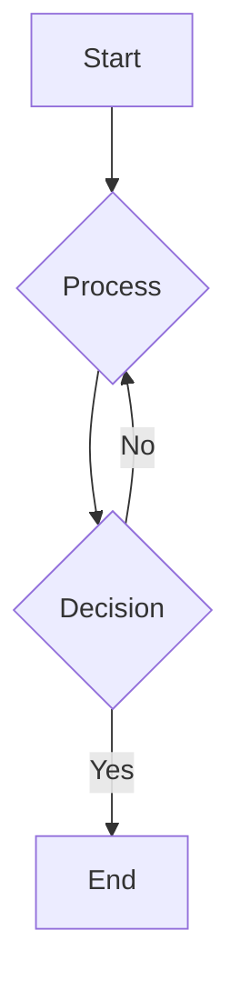

# Correctness and Consistency

> The C in CAP theorem [^1]

If you have any interest in distributed systems, please have a look at this paper on **Linearizibility**[^2]. It is a consistency model used in concurrent databases like [etcd](https://etcd.io/).
I found about this model and the need for correctness gurantees while making a contibution to the robustness tests in etcd. You can have a look at the PR [here](https://github.com/etcd-io/etcd/pull/20877).

Consistency is an important parameter to have when designing a distributed system. Imagine this, a distributed database works by sharing its key value pairs among multiple nodes.
This is done to distribute huge traffic load and to add fault tolerance. Even if one or two nodes go down, our system is affected in very less capacity.

But this comes with a big problem: We have to gurantee correctness (or consitent behavior). This means the client should only see correct values even though the database supports concurrent requests.

## Linearizability: Consistency model

The paper[^1] summarizes this like so

>Linearizability provides the illusion that each operation applied by concurrent processes takes effect instantaneously at some point between its invocation and its response.

To understand this model, let us attach meaning to some terms which we are going to use further in this discussion.
- Assume each operation has two timestamps associated: *start* and *end*
- Now assume that any operation (get or put) finishes **instantaneously** at some point between its start and end times
- Global order: operations appear to be executed in a linear order, making the system behave as if there is no concurrency
- If such a linear order can be defined for a series of operations, we conclude that the system is **linearizable**

Let us look at an example to understand this

---
[^1]: [Proof of CAP theorem](https://mwhittaker.github.io/blog/an_illustrated_proof_of_the_cap_theorem)
[^2]: [Linearizability: a correctness condition for concurrent objects](https://dl.acm.org/doi/10.1145/78969.78972)
